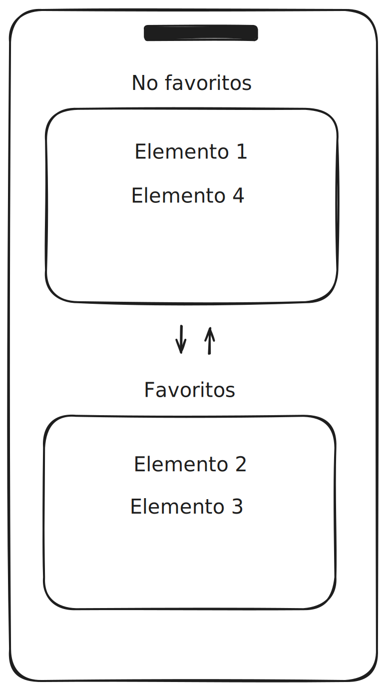

# Prueba técnica React Native

Realizar una aplicación la cual permita a un usuario iniciar sesión usando Firebase. Al iniciar sesión deberá llamar una lista elementos de una API pública y mostrarlos en una tabla la cual contenga dos columnas (Favoritos, No favoritos). Al dar clic en algún elemento, este se deberá mover la columna contraria.


## Criterios de aceptación

1. Clonar el este repositorio y usarlo como base del proyecto.
2. Se debe poder iniciar sesión usando correo y contraseña mediante la API de [Firebase](https://firebase.google.com/).
3. La pantalla principal de la aplicación debe consistir de una tabla con dos secciones.
  
4. Se debe realizar un solicitud HTTP a la siguiente url: [https://pokeapi.co/api/v2/pokemon](https://pokeapi.co/api/v2/pokemon).

```json
{
  "count": 1302,
  "next": "https://pokeapi.co/api/v2/pokemon?offset=20&limit=20",
  "previous": null,
  "results": [
    {
      "name": "bulbasaur",
      "url": "https://pokeapi.co/api/v2/pokemon/1/"
    },
    {
      "name": "ivysaur",
      "url": "https://pokeapi.co/api/v2/pokemon/2/"
    },
    {
      "name": "venusaur",
      "url": "https://pokeapi.co/api/v2/pokemon/3/"
    }
  ]
}
```
5. Obtener los detalles de cada uno de los elementos usando el endpoint correspondiente [https://pokeapi.co/api/v2/pokemon/:id/](https://pokeapi.co/api/v2/pokemon/1/).
6. En el archivo `app/utis/index.ts` existe una funcion que organiza los elementos del punto anterior en base a su altura de una manera ineficiente. Refactorizarla y usarla para organizar los elementos mostrados al usuario.
7. Los elementos obtenidos se deben mostrar en la primera columna de la tabla.
8. Al presionar en cualquiera de los elementos, este se debe mover a la columna contraria. Si está en *Favoritos* se moverá a *No favoritos* y viceversa. Se debe mantener el orden de los elementos en base al campo `height`

## Mejora la calificación si...

- Realiza pruebas del código
- Se usa alguna librería de estilos a elección
- Se organiza el código de manera adecuada
- Los commits tienen un formato apropiado
